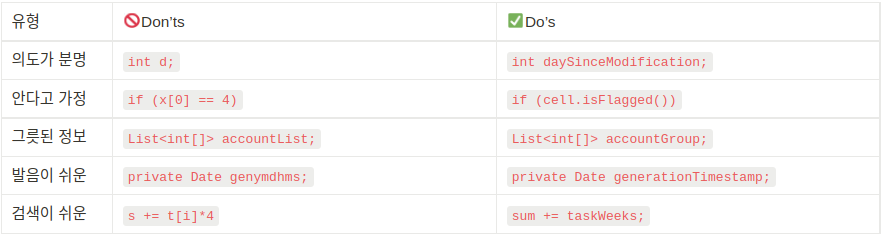

클린코드 **Chapter 2. 의미 있는 이름** #노마드코더 #북클럽 #노개북

## TL;DR (3줄 요약)

1. 함수가 하는 일을 이해하기 쉽게 이름을 지어라.
2. 발음하기 어렵고 **기발한** 이름은 피하라.(genymdhms 같은거..)
3. 불필요한 맥락 없이, 검색하기 쉬운게 좋아.

## 무엇이 기억에 남았는지? 헷갈린건?

&nbsp;포인트는 코드를 보는 독자로 하여금 이해하기 쉽게 이름을 짓는 것이다. 

그러니까 이런건 피해야한다. 

🚫(추가로)Don'ts 로는 

- 헝가리안 표기법을 쓰지 말 것. (변수, 필드명에 데이터의 형식을 유추할 수 있도록 변수명에 접두어를 붙이는 표기법)
- 말장난 같이 단어 1개에 2가지 개념을 쓰지 말 것.
- 불필요한 맥락을 피할 것.
   

✅Do's는 
클래스 : 명사, 명사구 
메서드 : 동사, 동사구 

&nbsp아무튼 정말 글을 쓰듯이 코드 독자가 익숙한 것을 위주로 이름을 붙이라는 내용도 있었다. 마치 수수께끼 하듯 유추하게 하는건 미래의 나와 동료들을 괴롭히는 행동이다.
  

---

&nbsp물론 헷갈리는 것도 있었다. 
p31. 에 인터페이스가 무슨 말인지 잘 모르겠고 
p35. 에 의미 있는 맥락에서 말하는 함수..? 클래스도 나중에 봐야할 것 같다. (~~르블랑 법칙에 의해 안하고 말겠지...~~)

## 읽은 소감

&nbsp;참 공감이 갔던건 다른 개발자가 반대할까 두려워 변수명을 바꾸지 못하는 상황 이었다. 
그런데 사실 개발자는 변수명을 외우고 있지 않기에 이를 올바르게 바꿔주는게 오히려 고마운 거라는 말이 맞는 것 같다.
  

&nbsp;그리고 이해하는데 도움이 되는 예시 코드들이 많은 점이 좋았다. 
앞으로 전문가 처럼 변수에는 **가장 명료한 이름**을 써야겠다.
   
최종 작성일 : 2022-04-25
